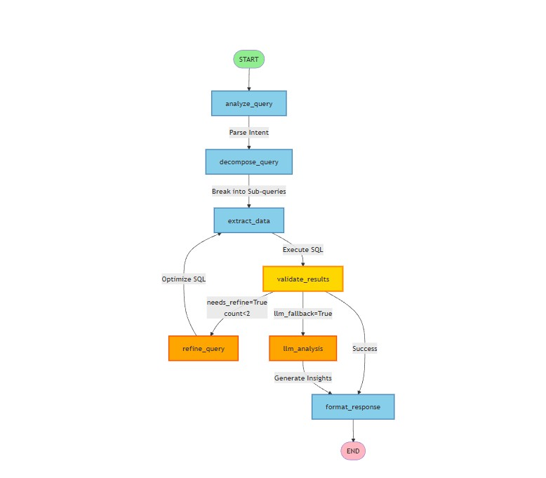
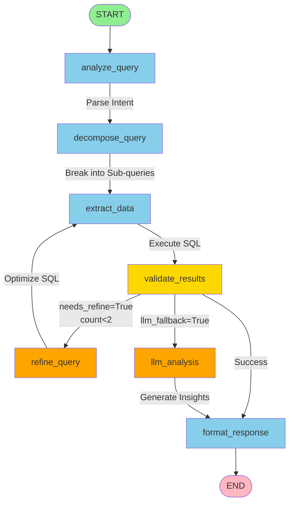

# LangGraph Workflow Visualization

## Architecture Overview

This document describes the 7-node state machine used in the LangGraph agent for complex query resolution.

## Workflow Diagram



*Figure: 7-Node LangGraph State Machine with Conditional Routing*

### Interactive Mermaid Diagram



## Node Descriptions

### 1. **analyze_query**
- **Purpose**: Parse user question and identify query intent
- **Input**: user_query (string)
- **Output**: query_analysis (dict with intent, type, confidence)
- **Agent**: EnhancedQueryResolutionAgent
- **Next**: decompose_query

### 2. **decompose_query**
- **Purpose**: Break complex queries into logical sub-queries
- **Trigger**: Only for comparison, timeseries, or custom query types
- **Output**: sub_queries (array of strings)
- **Example**: "Compare Q1 vs Q2" → ["Q1 revenue", "Q2 revenue", "calculate delta"]
- **Next**: extract_data

### 3. **extract_data**
- **Purpose**: Generate and execute SQL queries
- **Process**: 
  - Build SQL from query analysis
  - Execute via DuckDB
  - Handle sub-queries if decomposed
  - Combine results intelligently
- **Output**: extracted_data (dict with results, SQL, row_count)
- **Next**: validate_results

### 4. **validate_results** (Conditional Router)
- **Purpose**: Data quality checks and routing decision
- **Checks**:
  - Row count > 0?
  - Data quality sufficient?
  - Confidence score acceptable?
- **Routing**:
  - `needs_refine=True` → refine_query (max 2 iterations)
  - `llm_fallback=True` → llm_analysis
  - Otherwise → format_response (success)

### 5. **refine_query** (Conditional)
- **Purpose**: SQL optimization when initial query fails/underperforms
- **Trigger**: Low confidence or poor results
- **Max Iterations**: 2 (prevents infinite loops)
- **Output**: Updated SQL query
- **Next**: extract_data (retry)

### 6. **llm_analysis** (Fallback)
- **Purpose**: LLM-based insights when data extraction fails
- **Use Cases**:
  - No data returned
  - SQL generation failed
  - Complex analytical reasoning required
- **Process**: Send raw data to LLM for interpretation
- **Next**: format_response

### 7. **format_response**
- **Purpose**: Final output formatting and confidence scoring
- **Output**: Structured response with:
  - Summary text
  - Data preview
  - Confidence score
  - SQL query used
  - Visualization data
- **Next**: END

## State Machine Flow

### Happy Path (Simple Query)
```
START → analyze_query → decompose_query (skip) → extract_data 
  → validate_results → format_response → END
Time: 3-5 seconds
```

### Complex Query Path
```
START → analyze_query → decompose_query (3 sub-queries) → extract_data
  → validate_results → format_response → END
Time: 5-8 seconds
```

### Refinement Path
```
START → analyze_query → decompose_query → extract_data 
  → validate_results → refine_query → extract_data
  → validate_results → format_response → END
Time: 7-10 seconds (includes retry)
```

### LLM Fallback Path
```
START → analyze_query → decompose_query → extract_data
  → validate_results → llm_analysis → format_response → END
Time: 4-6 seconds (LLM inference)
```

## Key Features

### 1. Intelligent Routing
- Dynamic path selection based on query complexity
- Automatic fallback to LLM when SQL fails
- Iterative refinement with loop prevention

### 2. State Management
- Flat state dictionary (no nesting)
- Persistent across all nodes
- Contains: query, analysis, data, metadata

### 3. Error Handling
- Graceful degradation to LLM fallback
- Maximum iteration limits (prevents infinite loops)
- Comprehensive logging at each node

### 4. Performance Optimization
- Skip unnecessary decomposition for simple queries
- Cache conversation context
- Early termination on success

## Comparison with Multi-Agent Pipeline

| Feature | LangGraph | Multi-Agent |
|---------|-----------|-------------|
| Architecture | State machine (7 nodes) | Linear pipeline (4 agents) |
| Routing | Conditional, dynamic | Sequential, fixed |
| Complexity | High (handles multi-step) | Low (straightforward) |
| Speed | 3-8 seconds | 1-3 seconds |
| Use Case | Complex analytical queries | Simple data retrieval |
| Refinement | Yes (iterative) | No |
| LLM Fallback | Yes | Limited |

## Technical Implementation

### Graph Construction
```python
workflow = StateGraph(dict)
workflow.add_node("analyze_query", self._node_analyze_query)
workflow.add_node("decompose_query", self._node_decompose_query)
workflow.add_node("extract_data", self._node_extract_data)
workflow.add_node("llm_analysis", self._node_llm_analysis)
workflow.add_node("validate_results", self._node_validate_results)
workflow.add_node("refine_query", self._node_refine_query)
workflow.add_node("format_response", self._node_format_response)

# Conditional routing at validation
workflow.add_conditional_edges(
    "validate_results",
    validation_router,
    {
        "refine_query": "refine_query",
        "llm_analysis": "llm_analysis",
        "format_response": "format_response"
    }
)
```

### State Schema
```python
state = {
    "user_query": str,              # Original question
    "query_analysis": dict,         # Parsed intent
    "sub_queries": list,            # Decomposed queries
    "extracted_data": dict,         # SQL results
    "needs_refine": bool,           # Refinement flag
    "llm_fallback": bool,           # Fallback flag
    "refinement_count": int,        # Iteration counter
    "confidence_score": float,      # 0.0-1.0
    "final_response": str           # Formatted output
}
```

## Visualization Files Generated

1. **langgraph_workflow.mmd** - Mermaid diagram (text)
   - Paste at: https://mermaid.live/ for interactive view
   
2. **langgraph_workflow.png** - PNG image (if graphviz installed)
   - Direct visual representation
   
3. **LANGGRAPH_VISUALIZATION.md** - This documentation

## Usage in Application

The LangGraph agent is available in the Q&A Chat tab:
- **Tab 2**: Select "LangGraph (Advanced)" agent
- **Best for**: Complex queries, comparisons, multi-step reasoning
- **Response time**: 3-8 seconds depending on complexity

---

